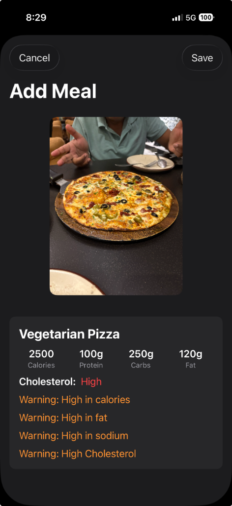
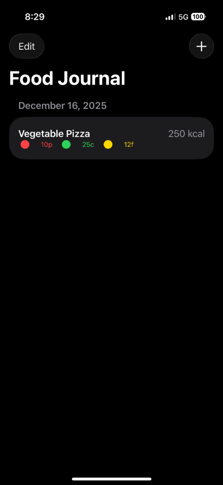

# Meals App 🥗

An intelligent food tracking application powered by AI.

Meals App helps you track your nutrition effortlessly. Just snap a photo of your meal, and our AI analyzes the calories, macros, and potential health warnings instantly.

## 📱 Screenshots

| Add Meal | Food Journal |
|:---:|:---:|
|  |  |

 

> **Note**: The AI automatically identifies food items, estimates portion sizes, and calculates nutritional values.

## ✨ Key Features

- **📸 AI Food Analysis**: Instantly analyze meals from photos using the Gemini API.
- **📊 Nutritional Breakdown**: detailed stats for Calories, Protein, Carbs, and Fat.
- **⚠️ Health Warnings**: Smart alerts for high sugar, sodium, fat, or cholesterol.
- **📅 Food Journal**: Keep a daily log of all your meals with color-coded macro indicators.
- **🍎 Dietary Insights**: Simple visual indicators (Red/Green/Yellow) for quick nutritional assessment.

## 🛠 Technology Stack

- **SwiftUI**: Modern, declarative UI framework.
- **Google Gemini API**: Multimodal AI for image recognition and nutritional analysis.
- **Swift Concurrency**: Async/Await for smooth performance.
